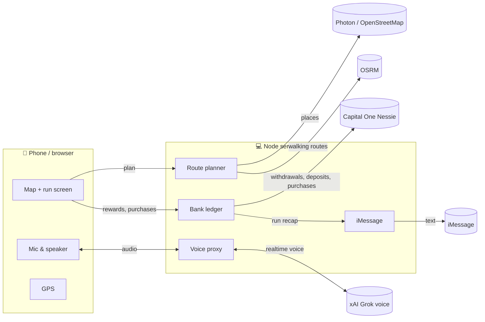

# Stride: run, route, save

**A voice running coach that routes you to places you love and turns every mile into savings.**

Tell Stride how far you want to run and where you'd like to end up, e.g. *"a 5K that ends at coffee under $6"*.
It finds up to three real routes to real places nearby and guides you turn by turn by voice. Every mile you run
moves money from your checking account into a savings goal.

Built for a hackathon with the theme **Navigation**.

---

## The idea

Running and saving are two habits people struggle to keep. Stride links them so each one pushes the other:

- **Running builds savings.** Every mile moves $1 (configurable) from checking into a goal like *Marathon Fund*.
- **Saving motivates running.** Watching the goal grow is a reason to get out the door.
- **Skipping still saves.** Log a skipped run and a $5 penalty moves to savings, so running is the cheaper choice.
- **Spending stays on budget.** Each route shows an estimated price at the destination. When you arrive, you log
  what you spent, and if you came in under budget, one tap moves the difference to savings.

No money is created: you are paying yourself, with your runs as the trigger.

## Features

| | |
|---|---|
| 🗺️ **Destination-based routes** | Pick a distance plus a destination type (coffee, smoothie, grocery, treat, ATM, surprise). Stride finds real places and builds walking routes that match your distance (±7%). |
| 🗣️ **Voice coach** | Spoken turn-by-turn cues, mile splits, and a conversational coach (Grok voice) that can plan routes, start runs, and move money by voice. Falls back to the browser's built-in voice. |
| 📍 **Live GPS tracking** | Strava-style distance from real GPS with jitter smoothing and glitch filtering. A live blue dot, a GPS signal indicator, off-route warnings, and automatic arrival detection. |
| 🏦 **Capital One Nessie** | Every reward, penalty and purchase is recorded in Nessie. **Verify balances** rebuilds both balances from Nessie's transaction history. |
| 🏁 **Challenges & pledges** | Set a race, a timed run or a mileage goal, share the link, and friends pledge: **flat** (paid if you make it) or **per mile** (paid for miles run, capped), plus just-for-fun **finish-time predictions**. A qualifying run settles it automatically: pledges move from each backer's checking into your savings goal, mirrored to Nessie for both people. |
| 👤 **Accounts** | Email + password sign-in (scrypt-hashed, cookie sessions), or **try as a guest** and upgrade later without losing data. Every user has their own runs, goal and Nessie accounts. |
| 🔔 **Push notifications** | Run recaps and goal alerts on iPhone (home-screen app, iOS 16.4+) and desktop browsers, via Web Push. |
| 💬 **iMessage recaps** | When the server runs on a Mac, Photon's iMessage kit texts each user a recap. Reply `BALANCE`, `RUNS` or `SKIP`. |
| 📱 **Installable on iPhone** | A Progressive Web App: *Share → Add to Home Screen* for a full-screen app with its own icon. |
| 🧪 **Demo mode** | *Simulate* moves a virtual runner along the route at 1×–60× for indoor demos. |

## How it works



### Route planning (`lib/planner.js`)
1. **Find places** near you with [Photon](https://photon.komoot.io) (OpenStreetMap data); [Overpass](https://overpass-api.de) is the backup.
2. **Pick three** in different directions, preferring places within your budget.
3. **Build walking routes** with [OSRM](https://project-osrm.org)'s foot profile. If the café is closer than your
   target distance, Stride adds a detour waypoint on an ellipse around start and finish, re-routing until the length is within ~7%.
4. **Turn-by-turn text** comes from OSRM's maneuvers, trimmed to turns that matter.
5. If map services are down, Stride generates practice routes so a demo never dead-ends.

Prices are estimates (chain averages or category defaults), since OpenStreetMap doesn't include menus.

### Money (`lib/bank.js`, `lib/nessie.js`)
A local ledger keeps the UI instant and every movement is mirrored to Capital One's
[Nessie](https://api.nessieisreal.com) sandbox:

| In Stride | In Nessie |
|---|---|
| Mile reward, skipped-run penalty, under-budget bonus | Withdrawal from **Checking** + deposit into **Savings** |
| Post-run coffee | Merchant **purchase** from Checking |

Nessie stores whole numbers and doesn't update balances on its own, so amounts are sent in **cents** and
`verify()` recomputes balances as *opening balance + deposits − withdrawals − purchases*.

### Challenges (`lib/challenges.js`, `public/js/challenges.js`)
- **Types:** `run` (one run covers the distance, optionally under a time goal) or `total` (miles add up before the deadline).
- **Pledges are support, not bets:** money only flows from backers to the runner's savings, never between backers, so there's no wager.
- **Settlement:** after each recorded run, open challenges are checked; a completed one pays every pledge in one pass
  (claimed atomically so it can't pay twice). At the deadline, a background sweep closes missed challenges:
  per-mile pledges pay for miles run and flat pledges are released.
- **Anti-cheat:** simulated runs don't count in production (`NODE_ENV=production`, override with `ALLOW_SIM_CHALLENGES`).
- **Sharing:** `/c/<code>` links open the challenge; signed-out visitors see who they're backing, then sign up or continue as a guest.

### Voice (`server.js`, `public/js/voice.js`)
The browser streams 24 kHz PCM microphone audio over a WebSocket to `/realtime`. The server relays it to
xAI's realtime voice API with the API key attached, so the key never reaches the client. Grok calls app
tools (`plan_routes`, `choose_route`, `start_run`, `get_run_status`, `get_savings`, `transfer_to_savings`, `log_purchase`).
Without a working key, a keyword parser (`public/js/commands.js`) maps speech or typed text onto the same tools.

### Run tracking (`public/js/run.js`)
- **Distance** is measured from real GPS movement: fixes worse than ±50 m are ignored, the last 3 fixes are averaged,
  and jumps faster than a sprint are treated as glitches.
- **The route** is used only for navigation: each fix is projected onto the route line to time turn cues ~8 s ahead.
- **Arrival** triggers within ~30 m of the destination.
- A screen wake lock keeps iPhone location updates flowing during the run.

## Getting started

Requirements: **Node.js 20+**. iMessage features need **macOS**.

```bash
git clone <this repo>
cd stride
npm install
cp .env.example .env    # fill in the keys you have; all are optional
npm start               # → http://localhost:3000
```

### Environment variables (`.env`)

| Variable | Purpose | Without it |
|---|---|---|
| `XAI_API_KEY` | Grok voice ([console.x.ai](https://console.x.ai)) | Browser speech + keyword commands |
| `XAI_VOICE` | Grok voice name (default `eve`) | |
| `NESSIE_API_KEY` | Capital One Nessie ([nessieisreal.com](http://nessieisreal.com)) | Local ledger only |
| `DATABASE_PATH` | SQLite file (default `data/stride.db`); on a cloud host, a persistent disk | |
| `VAPID_SUBJECT` | Contact for push services, e.g. `mailto:you@example.com` | |
| `IMESSAGE_ENABLED` | `1` to text run recaps (macOS host only; users add their number in Wallet) | No texts |
| `PORT` | Server port (default `3000`) | |

Push-notification keys are generated on first start and stored beside the database.

The server prints the status of each integration on startup.

### Deploy to the cloud
The repo includes a `Dockerfile` and a Render blueprint (`render.yaml`):

1. On [render.com](https://render.com): **New → Blueprint** → pick this repo.
2. Fill in `XAI_API_KEY`, `NESSIE_API_KEY` and `VAPID_SUBJECT` when asked.
3. Render builds the container, mounts a disk at `/data` for the database, and gives you a permanent `https://…onrender.com` link.

Any Docker host works (Fly.io, Railway, a VPS): run the image with a volume at `/data`.
iMessage recaps need a Mac host, so they're off in the cloud; push notifications replace them.

### On an iPhone (local server)
Phones only allow GPS and the microphone on **https**, so expose the server with a tunnel:

```bash
curl -L https://github.com/cloudflare/cloudflared/releases/latest/download/cloudflared-darwin-arm64.tgz | tar xz
./cloudflared tunnel --url http://localhost:3000     # prints https://<random>.trycloudflare.com
```

Open the link in **Safari** → **Share** → **Add to Home Screen**. Keep the Mac awake while you use it.

### iMessage replies
Give your terminal app **Full Disk Access** (System Settings → Privacy & Security) so Stride can read replies.
Sending works without it.

## Project structure

```
server.js              Express server, API routes, Grok voice WebSocket proxy
lib/
  db.js                SQLite schema (users, sessions, banks, transactions, runs, push)
  auth.js              Sign-up, sign-in, guest accounts, sessions
  push.js              Web Push notifications
  challenges.js        Challenges, pledges, predictions and settlement
  planner.js           Place search + distance-matched walking routes
  bank.js              Per-user ledger: rewards, purchases, penalties, runs
  nessie.js            Capital One Nessie mirror + balance verification
  imessage.js          Run recaps and text commands (Photon imessage-kit)
public/
  index.html           App shell
  styles.css           Light/dark theme, mobile-first layout
  sw.js, manifest      PWA install + offline shell
  js/app.js            UI state, views, tools shared by Grok and the fallback
  js/run.js            GPS / simulated run engine
  js/map.js            Leaflet map, routes, live location dot
  js/voice.js          Grok realtime client + Web Speech fallback
  js/commands.js       Keyword command parser
  js/challenges.js     Challenge list, create form, detail + pledge form
  js/geo.js            Geometry and formatting helpers
data/                  Database + push keys (git-ignored)
Dockerfile, render.yaml  Cloud deployment
```

## Built with

- [xAI Grok Voice Agent API](https://docs.x.ai): realtime voice conversation with tool calling
- [Capital One Nessie](https://api.nessieisreal.com): banking sandbox
- [Photon iMessage Kit](https://github.com/photon-hq/imessage-kit): iMessage on macOS
- [Photon geocoder](https://photon.komoot.io), [OSRM](https://project-osrm.org) and [OpenStreetMap](https://www.openstreetmap.org): places, walking routes, map tiles
- [Leaflet](https://leafletjs.com): map rendering
- Node.js, Express, plain JavaScript (no build step)

## Limitations

- Destination prices are estimates.
- Public map servers are fine for demos; a production app would self-host OSRM/Photon or use a commercial provider.
- Nessie is a sandbox with fake money.
- iMessage requires the server to run on a Mac signed into Messages.
- The web app can't track GPS with the iPhone screen locked; a native app would.

## Future work

- **Native iPhone app** (React Native/Expo) for background GPS, Apple Watch and HealthKit.
- **Real accounts via Plaid**, starting read-only with user-approved transfers.
- **Partner cash back:** cafés pay to be route destinations; runners get cash back into savings.
- **Group goals:** running clubs pool miles toward a shared goal.
- **Streak multipliers** and custom rules (e.g. $2/mile on hills).
- **Spending insights:** "you spent $38 on post-run coffee this month."
- **Real accounts and wearables:** Capital One APIs or Plaid; Apple Watch, Strava and Garmin for miles.
